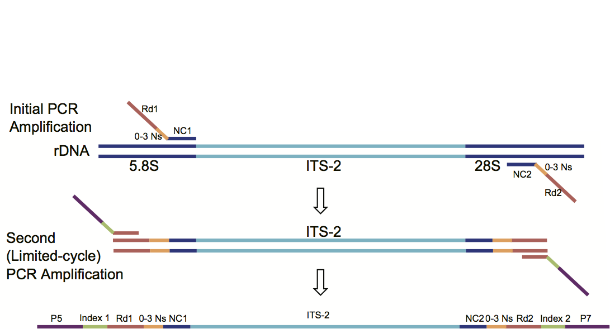

---
params:
  table_format: html
---

```{r setup, include=FALSE}
library(knitr)
library(kableExtra)
library(dplyr)
knitr::opts_chunk$set(echo = FALSE, message = FALSE)
options(knitr.table.format = params$table_format) 
```

# Sequencing Protocols {.tabset .tabset-pills .tabset-fade}

Download a pdf of all the protocols for printing <a href="downloads/sequencing.pdf">here</a>

## Library preparation

### Amplication of ITS-2 region 

<figure>

<figcaption>Diagram of primer hybridization</figcaption>
</figure>
<br>

#### Reagents required

* Kapa HiFi Hotstart PCR kit with dNTPs (Kapa Biosystems, KK2502)
* 0.2ml 96-well plates, clear, half-skirted (VWR, 83007-374)
* Microseal "A" film (Biorad, MSA-5001)
* 1.5 ml tubes
* 8-channel pipettor
* filter aerosol tips
* mol grade water
* thermocycler


```{r}
data_frame(
	Name = c("NC1_with_Illumina_Adapter_(0N)", "NC1_with_Illumina_Adapter_(1N)",
					 "NC1_with_Illumina_Adapter_(2N)", "NC1_with_Illumina_Adapter_(3N)"),
	Sequence = c("TCGTCGGCAGCGTCAGATGTGTATAAGAGACAGACGTCTGGTTCAGGGTTGTT",
							 "TCGTCGGCAGCGTCAGATGTGTATAAGAGACAGNACGTCTGGTTCAGGGTTGTT",
							 "TCGTCGGCAGCGTCAGATGTGTATAAGAGACAGNNACGTCTGGTTCAGGGTTGTT",
							 "TCGTCGGCAGCGTCAGATGTGTATAAGAGACAGNNNACGTCTGGTTCAGGGTTGTT")
) %>% kable(booktabs = TRUE, caption = "Forward Primers") %>% 
	kable_styling(bootstrap_options = c("striped", "hover", "condensed", "responsive"),
								latex_options = c("striped", "hold_position", "scale_down"),
								full_width = FALSE, position = "left")
```


```{r}
data_frame(
	Name = c("NC2_with_Illumina_Adapter_(0N)", "NC2_with_Illumina_Adapter_(1N)",
					 "NC2_with_Illumina_Adapter_(2N)", "NC2_with_Illumina_Adapter_(3N)"),
	Sequence = c("GTCTCGTGGGCTCGGAGATGTGTATAAGAGACAGTTAGTTTCTTTTCCTCCGCT",
							 "GTCTCGTGGGCTCGGAGATGTGTATAAGAGACAGNTTAGTTTCTTTTCCTCCGCT",
							 "GTCTCGTGGGCTCGGAGATGTGTATAAGAGACAGNNTTAGTTTCTTTTCCTCCGCT",
							 "GTCTCGTGGGCTCGGAGATGTGTATAAGAGACAGNNNTTAGTTTCTTTTCCTCCGCT")
) %>% kable(booktabs = TRUE, caption = "Reverse primers") %>% 
	kable_styling(bootstrap_options = c("striped", "hover", "condensed", "responsive"),
								latex_options = c("striped", "hold_position", "scale_down"),
								full_width = FALSE, position = "left")
```


#### Protocol

1. UV treat plasticware and mol grade water for 15 min prior to PCR set-up
2. Combine 2.5 $\mu$l of each of the forward primers at stock concentration (100 nM) to 90 $\mu$l of mol grade water to achieve forward primer mix at 10nM working concentration. Do the same for the reverse primers.
3. On ice make-up Mastermix using forward and reverse primer mixes and the recipe below.
4. Aliquot mastermix (21 $\mu$l) to each well of 96-well plate
5. Add 4 $\mu$l template (lysate dilution) to wells using multi-channel pipettor
6. Place microseal "A" film over completed plate and place on thermocycler (with pre-heated lid) and run the program below.  


```{r}
data_frame("volume ($\\mu$l)" = c("5", "0.75", "0.75", "0.75", "0.5", "13.25", "4"),
					 Reagent = c(
					 	"KAPA HiFi Buffer (x5)", "NC1 primer mix (10mM)", "NC2 primer mix (10mM)",
						"dNTPs (10mM)", "KAPA HiFi Polymerase (0.5U)", "mol grade water",
						"1:10 dilution of lysate")
					 ) %>% 
	kable(booktabs = TRUE, escape = FALSE, caption = "Mastermix (25$\\mu$l)") %>% 
	kable_styling(bootstrap_options = c("striped", "hover", "condensed", "responsive"),
								latex_options = c("striped" ),
								full_width = FALSE, position = "left")
```


**Cycling conditions**  

1. 95 for 2 min  
2. 98 for 20 sec  
3. 62 for 15 sec  
4. 72 for 15 sec  
5. Repeat steps 2-4 25 times
6. 72 for 2 min  

<div class="panel panel-warning">
<div class="panel-heading">Caution</div>
<div class="panel-body">

*Cycles kept low to limit potential bias, but can be increased to 30-35 cycles for samples with low DNA. If amplicons are not to be cleaned immediately store at -20. It is not advisable though to delay the library preparation process as PCR products will degrade even at -20 if stored for longer than a couple of days*

</div>
</div>

### Magnetic bead purification  

#### Reagents required
* AMPure XP beads (Beckman Coulter, A63881) - Aliquot and store at $4\,^{\circ}{\rm C}$
* 96-well Magnetic-Ring stand (Applied biosystems, AM10050)
* 0.8 ml 96-well storage plates (Thermo-Scientific, AB-0859)
* 0.2 ml 96-well plate, clear, half-skirted (VWR, 83007-374)
* 8-channel pipettors
* Reagent reservoirs
* abosolte ethanol (mol grade)  
* mol grade water  

<div class="panel panel-info">
<div class="panel-heading">Note</div>
<div class="panel-body">

*Filter aerosol pipette tipss and 8-channel pipettor used for majority of steps in this protocol. Also all quantities quoted are for clean-up of a full plate (96 samples)*  

</div>
</div>

#### Protocol
1. Bring an aliquot of AMPure beads to room temp  
2. Prepare fresh 80% ethanol from mol grade absolute ethanol (50 ml)   
3. Centrifuge amplification plate to collect condensation (300 G for 2 min)  
4. Remove seal from plate in bio-safety cabinet (if possible)  
5. Transfer the 25 $\mu$l reactions into 0.8 ml 96-well storage plates using multi-channel pipettor  
6. Voretx beads for 30 sec to ensure even disperal before placing in reagent reservoir  
7. Transfer 25 $\mu$l of beads to each well of the storage plate and gently pipet up and down 10 times to ensure the beads are well-mixed with the PCR sample  
8. Incubate at room temp for 5 min  
9. Place plate on magnetic stand for 2 min (or until supernatent has cleared)
10. Once clear use multi-channel pipettor to remove and discard supernatent from the wells  
11. With the plate still on the magnetic stand, wash beads with 80% ethanol by adding 200 $\mu$l to each well (using a multi-channel pipettor and a reagent reservoir). Do not re-suspend the beads at this point  
12. Incubate for 30 sec (or until clear) and then remove and discard supernatent  
13. Wash again with another 200 $\mu$l of 80% ethanol. Incubate for 30 sec and then as before remove and discard supernatant.  
14. Use a small volume single-channel pipettor (P20, with fine tips) to remove excess ethanol from each well  
15. Allow beads to air-dry for 15 min  
16. Remove plate from magnetic stand  
17. Add 40 $\mu$l of mol grade water to each well with multi-channel pipettor and gently pipet up and down 10 times to re-suspend the beads  
18. Incubate at room temp for 2 kmin  
19. Place the plate back on the magnetic stand for 2 min (or until cleared)  
20. Transfer approx 34 $\mu$l of the supernatent to a new 0.2 ml 96-well plate without touching the beads  
21. A microseal "A" is placed over cleaned-up samples to allow temporary storage at $-20\,^{\circ}{\rm C}$  

### Addition of Illumina barcodes  

#### Reagents required:   
* Kapa HiFi Hotstart PCR kit with dNTPs (Kapa Biosystems, KK2502)
* 0.2 ml 96-well plates, clear, half-skirted (VWR, 83007-374)
* Microseal "A" film (Biorad, MSA-5001)
* 1.5 ml tubes
* 8-channel pipettor
* filter aerosol tips
* mol grade water
* thermocycler  


```{r}
data_frame(`Primer name` = c("N501_i5", "N502_i5", "N503_i5", "N504_i5", "N505_i5",
														 "N506_i5", "N507_i5", "N508_i5"),
					 `Sequence of primer` = c(
					 		"AATGATACGGCGACCACCGAGATCTACACTAGATCGCTCGTCGGCAGCGTC",
							"AATGATACGGCGACCACCGAGATCTACACCTCTCTATTCGTCGGCAGCGTC",
							"AATGATACGGCGACCACCGAGATCTACACTATCCTCTTCGTCGGCAGCGTC",
							"AATGATACGGCGACCACCGAGATCTACACAGAGTAGATCGTCGGCAGCGTC",
							"AATGATACGGCGACCACCGAGATCTACACGTAAGGAGTCGTCGGCAGCGTC",
							"AATGATACGGCGACCACCGAGATCTACACACTGCATATCGTCGGCAGCGTC",
							"AATGATACGGCGACCACCGAGATCTACACAAGGAGTATCGTCGGCAGCGTC",
							"AATGATACGGCGACCACCGAGATCTACACCTAAGCCTTCGTCGGCAGCGTC"),
					 `Row in 96-well plate` = c("A", "B", "C", "D", "E", "F", "G", "H")
					 ) %>% 
	kable(booktabs = TRUE, caption = "Forward primers") %>% 
	kable_styling(bootstrap_options = c("striped", "hover", "condensed", "responsive"),
								latex_options = c("striped", "hold_position", "scale_down"),
								full_width = FALSE, position = "left")
```


```{r}
data_frame(`Primer name` = c("N701_i7", "N702_i7", "N703_i7", "N704_i7", "N705_i7", 
														 "N706_i7", "N707_i7", "N708_i7", "N709_i7", "N710_i7", 
														 "N711_i7", "N712_i7"),
					 `Sequence of primer` = c(
					 		"CAAGCAGAAGACGGCATACGAGATTCGCCTTAGTCTCGTGGGCTCGG",
							"CAAGCAGAAGACGGCATACGAGATCTAGTACGGTCTCGTGGGCTCGG",
							"CAAGCAGAAGACGGCATACGAGATTTCTGCCTGTCTCGTGGGCTCGG",
							"CAAGCAGAAGACGGCATACGAGATGCTCAGGAGTCTCGTGGGCTCGG",
							"CAAGCAGAAGACGGCATACGAGATAGGAGTCCGTCTCGTGGGCTCGG",
							"CAAGCAGAAGACGGCATACGAGATCATGCCTAGTCTCGTGGGCTCGG",
							"CAAGCAGAAGACGGCATACGAGATGTAGAGAGGTCTCGTGGGCTCGG",
							"CAAGCAGAAGACGGCATACGAGATCCTCTCTGGTCTCGTGGGCTCGG",
							"CAAGCAGAAGACGGCATACGAGATAGCGTAGCGTCTCGTGGGCTCGG",
							"CAAGCAGAAGACGGCATACGAGATCAGCCTCGGTCTCGTGGGCTCGG",
							"CAAGCAGAAGACGGCATACGAGATTGCCTCTTGTCTCGTGGGCTCGG",
							"CAAGCAGAAGACGGCATACGAGATTCCTCTACGTCTCGTGGGCTCGG"),
					 `Column in 96-well plate` = c(
					 	"1", "2", "3", "4", "5", "6", "7", "8", "9", "10", "11", "12")
					 ) %>% 
	kable(booktabs = TRUE, caption = "Reverse primers") %>% 
	kable_styling(bootstrap_options = c("striped", "hover", "condensed", "responsive"),
								latex_options = c("striped", "hold_position", "scale_down"),
								full_width = FALSE, position = "left")
```


#### Protocol
1. UV pasticware and mol grade water for 15 min prior to PCR set-up
2. On ice make-up Mastermix of water, buffer and dNTPs only (No polymerase or primers yet).
3. Aliquot mastermix (19 $\mu$l) to each well of 96-well plate
4. Add 1.25 $\mu$l forward primer to each well of the designated row (A-H, see table above).
5. Add 1.25 $\mu$l reverse primer to each well of the designated column (1-12, see table above).
5. Add 0.5 $\mu$l polyermase to each well
6. Add 3 $\mu$l template (amplicons from the 1st round of PCR) to wells using multi-channel pipettor
7. Place microseal "A" film over completed plate and place on thermocycler (with pre-heated lid) and run the program below.
8. The resulting PCR products are cleaned-up using the magnetic bead purification protocol similiar to the 1st round of PCR (see section 3.2 above).


```{r}
data_frame("volume ($\\mu$l)" = c("5", "1.25", "1.25", "0.75", "0.5", "13.25", "3"),
					 Reagent = c("KAPA HiFi Buffer (x5)", "Forward primer, N501-508 (10mM)", 
					 						"Reverse primer, N701-712 (10mM)", "dNTPs (10mM)", 
					 						"KAPA HiFi Polymerase (0.5U)", "mol grade water", 
					 						"1st round PCR product")) %>% 
	kable(booktabs = TRUE, escape = FALSE, caption= "Mastermix (25$\\mu$l)") %>% 
	kable_styling(bootstrap_options = c("striped", "hover", "condensed", "responsive"),
								latex_options = c("striped" ),
								full_width = FALSE, position = "left")
```


**Cycling conditions**  

1. 98 for 45 sec  
2. 98 for 20 sec  
3. 63 for 20 sec  
4. 72 for 2 min  
5. Repeat steps 2-4 7 times

<div class="alert alert-warning" role="alert">

Cycles kept low to limit potential bias

</div>

#### Individual sample quantification and pooling

1. Nanodrop quantification of cleaned-up products resulting from second round of PCR
2. Make normalized library by combining samples into a single tube to ensure all samples are present in equal concentrations (typically combine 50 ng per sample).This should ensure uniform coverage of reads for all samples in the library.
3. Nanodrop library and dilute with mol grade water to achieve approx 5 ng/$\mu$l


## Library Quantification

### Reagents required: 
* Illumina library Quantification Kit, Universal qPCR Mix (Kapa Biosystems, KK4824)
* qPCR machine
* Mol grade water
* 10 mM Tris-Hcl, pH 8 with 0.05% Tween-20
* Multiplate PCR plate, low profile, clear, unskirted, (Biorad, MLL9601)
* Microseal "B" seal (Biorad, MSB1001)

<div class="panel panel-info">
<div class="panel-heading">Note</div>
<div class="panel-body">

*When setting-up qPCR reactions always take care when pipetting small volumes and use filter aerosol pipette tips. Work on ice and use foil to prevent UV degradation of sybr green in master mix*

</div>
</div>

### Protocol 

1. Dilute library (1:1000) with 10 mM Tris-Hcl, pH 8 with 0.05% Tween-20 in triplicate
2. Using these 1:1000 dilutions set-up 1:2 serial dilutions to achieve 1:2000, 1:4000 and 1:8000 (keep in fridge until needed)
3. Before using the Illumina library Quantification kit for the first time add 1ml of primer premix (x10) to the 5ml bottle of Sybr fast qPCR Master mix (x2) and mix well
4. UV all plasticware and water for 15 min
5. Prepare qPCR plate by adding:
     * 12 $\mu$l Sybr fast qPCR mastermix (with primers added)  
     * 4 $\mu$l mol grade water  
     * and either 4 $\mu$l diluted library, one of supplied standards (Standard 1-6) or another 4 $\mu$l of mol grade water to act as a negative control
6. Place Microseal "B" seal over reactions
6. Run on qPCR machine with the following cycling conditions:
      95 for 5 min then 35 cycles of 95 for 30 sec and 60 for 45 sec
7. Look at data to confirm 90-100% reaction efficiency for samples and for standards
8. Calculate library quantification using absolute quantification against the 425 bp DNA standard


## Denanuration

### Reagents required

* Mol. grade water
* 1.5 ml eppendorf tubes
* Ice
* 5 M NaOH
* Vortex
* Bench-top centrifuge
* 10 mM Tris-Cl, pH 8.5 with 0.1% Tween-20
* Hybridization buffer (HT1, thawed and kept on ice)
* PhiX control v3 (Illumina, FC-110-3001)

### Protocol 

1. Dilute library to 4 nM with water
2. Prepare 1ml fresh 0.2 M NaOH from 5 M NaOH stock solution
3. Denature 4 nM library:  
      i) add 5 $\mu$l 4 nM library with 5 $\mu$l 0.2 M NaOH in new 1.5 ml tube
      ii) vortex briefly and centrifuge @ 300 g for 1 min
      iii) incubate at room temp. for 5 min
      iv) add 990 $\mu$l hybridization buffer (chilled) to produce 20 pm library
      v) place on ice
4. Dilute 20 pm library to 15 pmol: 
      i) add 900 $\mu$l 2 0pmol library to new 1.5 ml tube
      ii) add 300 $\mu$l hybridization buffer (chilled)
      iii) invert several times and place on ice
5. Prepare 4 nM PhiX library:
      i) add 2 $\mu$l 10 nM PhiX library to new 1.5 ml tube
      ii) add 3 $\mu$l 10 mM Tris-Cl, pH 8.5 with 0.1% Tween-20
6. Denature 4 nM PhiX library:
      i) add 5 $\mu$l 4 nM PhiX library with 5 $\mu$l 0.2 M NaOH to new 1. 5ml tube
      ii) vortex briefly and centrifuge @ 300 g for 1 min
      iii) incubate at room temp. for 5 min
      iv) add 990 $\mu$l hybridization buffer (chilled) to produce 20 pM PhiX library
      v) place on ice  
*This denatured 20 pM PhiX library can be stored at $-20\,^{\circ}{\rm C}$ for up to 3 weeks*
7. Dilute 20 pM PhiX library to 15 pM:  
      i) add 225 $\mu$l 20 pM Phix Library to new 1.5 ml tube
      ii) add 75 $\mu$l hybridization buffer (chilled)
      iii) invert several times and place on ice
8. Combine 15 pM libraries (80% sample library: 20% PhiX library):
      i) add 800 $\mu$l 15 pM sample library to new 1.5 ml tube
      ii) add 200 $\mu$l 15pM PhiX library
      iii) invert several times and place on ice until ready for loading into cartridge
      


## Loading combined libraries 

### Reagents required

* Illumina Miseq v2 Reagent Kit, 500 cycles (MS-102-2003, contains 2 boxes)  
*Box 1, contains Reagent cartridge and hybridization buffer (HT1)- store at $-20\,^{\circ}{\rm C}$*  
*Box 2, contains Flow cell and Incorporation buffer (RP2) - store at $4\,^{\circ}{\rm C}$*
* water bath
* tweezers
* mol grade water in sequeezy bottle
* kim wipes
* ethanol wipes

### Protocol 

1. Thaw cartridge in water bath at room temp. for 1 hour
2. Invert cartridge 10 times to mix reagents and bang down on bench to eliminate any visible air bubbles. 
3. Wipe foil covering of position 17 before piercing with a 1 ml pipette tip.
4. Load 600 $\mu$l of the "combined library" into the cartridge (position 17)
5. Start software and delete previous run to ensure >25% memory space on machine
6. Prepare and load flow cell
      i) use tweezers to remove flow cell from salt solution. 
      ii) wash-off salt with mol. grade water in a squeeze bottle, focusing on the nooks and crannies
      iii) dry thoroughly with kim wipe
      iv) use ethanol wipe to gently remove dust and grease stains from the flow cell
      v) remove old flow cell from machine and place new one into position
7. Load incorporation buffer and empty waste bottle into position and lower sippers
8. Load cartridge and csv sample sheet file


<!--html_preserve-->
<script type="text/javascript">
	$(function() {
  	// Javascript to enable link to tab
    var hash = document.location.hash;
    if (hash) {
      console.log(hash);
      $('.nav-tabs a[href="'+hash+'"]').tab('show');
    }
    // Change hash for page-reload
    $('a[data-toggle="tab"]').on('show.bs.tab', function (e) {
      window.location.hash = e.target.hash;
  	});
	});
</script>
<!--/html_preserve-->
